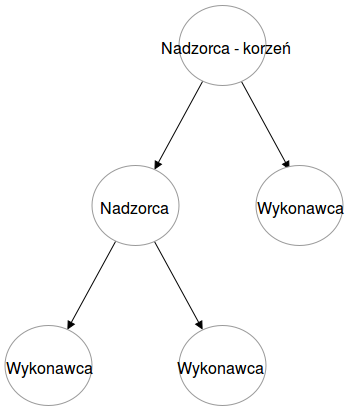
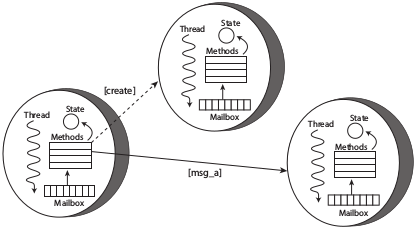

# Architektura systemu informatycznego

Złożoność systemów informatycznych stale rośnie. Wraz ze złożonością zwiększa się ich zapotrzebowanie na moc obliczeniową. Biorąc pod uwagę spowalniające prawo Moore'a, zaspokojenie potrzeby zwiększenia mocy jest znacznie utrudnione. Rozwiązaniem tego problemu jest stosowanie architektur równoległych, procesorów wielordzeniowych i układów wieloprocesorowych. Wzrost zainteresowania komputerami wielordzeniowymi niesie ze sobą narzut na programistów, zmuszając ich do tworzenia oprogramowania współbieżnego \autocite{stutter2005software}. Dominującym modelem programowania współbieżnego jest wykorzystanie pamięci współdzielonej pomiędzy wiele, działających paralelnie wątków. Jednakże, takie podejście jest nienaturalne dla deweloperów, bardzo łatwo popełnić błąd. Prowadzi to do powstawania oprogramowania nieodpornego na błędy, które trudno skalować \autocite{lee2006problem}.  
Problem rosnącego zapotrzebowania na moc obliczeniową można rozwiązać również przy zastosowaniu systemów rozproszonych. Za tym podejściem przemawia wiele czynników: geograficzne rozdystrybuowanie źródeł i ujść informacji, wymagania niższego czasu rekcji, niższa cena komputerów, zwiększona niezawodność, itp.
Z drugiej strony tworzenie systemów rozproszonych niesie ze sobą te same ograniczenia i problemy dostępu do współdzielonych zasobów jak wykorzystanie pamięci współdzielonej. Dodatkową komplikacją w tym przypadku jest tworzenie algorytmów korzystających z wielu maszyn jednocześnie. Klasycznym podejściem jest wykorzystanie czasu jako podstawy opracowywania algorytmów synchronizacji. Wprowadzenie dodatkowego czynnika jakim jest czas wynika z opóźnień powstałych w na etapie komunikacji pomiędzy procesami działającymi na odrębnych maszynach, jednakże dodatkowa zmienna znacznie zwiększa złożoność i nakład pracy \autocite{lamport1978time}.

## Java

Architektura silnie związana ze standardami JavaEE.

### Architektura wielowarstwowa

Standardowy wzorzec dla aplikacji JEE. Opis podziału na część webową, logikę biznesową i bazę danych. 

## JavaScript

Brak standardowych rozwiązań. Przedstawienie popularnych podejść z wielu, wynikających z szerokiej społeczności.

### Asynchroniczność - wzorzec Reaktor

libuv jako podstawa działania Node.js. Wady i zalety asynchroniczności dla modelu przyjętego w Node.js

## Elixir

### OTP

Erlang to nie tylko język programowania, ale również zestaw narzędzi i wzorców programistycznych zwanych *Open Telecom Platform* (OTP). Mimo swojej nazwy, jest to zbiór bibliotek ogólnego zastosowania, wprowadzający standardowe rozwiązania dla powszechnych problemów. Dodatkowo zawiera narzędzia do rozproszonej komunikacji, wykrywania błędów czy przeładowywania kodu działającego systemu. OTP wprowadza struktury generyczne dla różnych projektów informatycznych, które mają ułatwić pracę programistom, przykładowo standaryzowanej struktury plików projektowych, standardową bibliotekę powszechnie stosowanych funkcjonalności oraz zbiór tzw. behaviour (ang. zachowanie) będących wzorcami projektowymi dla różnorodnych systemów. Dzięki temu nowy pracownik zespołu może zauważyć znane wzorce, co ułatwia zapoznanie się z istniejącą bazą kodu.  
Podejście do współbieżności w Erlangu/OTP znacznie różni się od powszechnie stosowanego modelu dzielonej pamięci z blokadami. W tym przypadku wykorzystywany są lekkie procesy zarządzane przez wirtualną maszynę. Procesy te są od siebie całkowicie odizolowane, nie jest wykorzystana dzielona pamięć. Ze względu na taką separacje, komunikacja pomiędzy procesami odbywa się poprzez przesyłane między sobą wiadomości (ang. *message passing*). Dzielone informacje są kopiowane i przesyłane do innego procesu. Dzięki temu nie jest możliwa wielodostępowa modyfikacja danych, co zapobiega powstawaniu anomalii. Jednakże takie podejście nie jest bez wad, gdyż powielanie dużych bloków pamięci może być kosztowne.[patrz \ref{model-aktorowy}]  
W celu zapewnienia wysokiej niezawodności i odporności na błędy wprowadzone zostało jedno z ważniejszych *zachowań* OTP, "Supervisor" (ang. nadzorca). Jest on odpowiedzialny za tworzenie i monitorowanie stanu procesów wykonawczych. W sytuacji gdy proces wykonawczy, w wyniku błędu, przerwie pracę, wtedy nadzorca jest w stanie przywrócić poprawne funkcjonowanie systemu przywracając wykonawcę do normalnego stanu. Nadzorcy, będąc jedynie typem zachowania, mogą być traktowani jako zwykłe procesy wykonawcze, a zatem ich stan może być monitorowany przez innego nadzorcę tworząc w drzewa nadzorcze.

W ten sposób system nie posiada jednego punktu odpowiedzialnego za stabilność, a jest on podzielony na sekcje.  
Równie ważnym elementem OTP jest protokół komunikacji rozproszonej Erlanga. Podobnie jak lekkie procesy wirtualnej maszyny, komunikacja rozproszona bazuje na modelu aktorowym. Poza izolacją procesów na różnych węzłach komunikacji, istotną cechą protokołu jest jego transparentność. Wymiana wiadomości odbywa się w taki sam sposób jak pomiędzy procesami na jednej maszynie. Każdy z rozproszonych węzłów jest świadomy istnienia innych węzłów i może się z nimi komunikować tak jakby tworzyły jeden spójny system.

### Model aktorowy
 
- czym są aktorzy 
- podstawowe założenia
- rozwiązywane problemy

Aktorzy \autocite{hewitt1977laws, agha86actors} są modelem programowania współbieżnego. Są to obiekty o współbieżnym przetwarzaniu porozumiewające się wyłącznie asynchronicznymi wiadomościami. Każdy z aktorów przechowuje otrzymane wiadomości w skrzynce odbiorczej i przetwarza je sekwencyjnie, po jednej w danym czasie. 
Po przeprocesowaniu wiadomości aktor może zmienić swój stan, wysłać wiadomość lub stworzyć kolejnego aktora.  

Taki model przetwarzania pozwala uniknąć zablokowania przez czekającą wiadomość, co pozwala na łatwiejsze unikanie zakleszczeń w systemie.
Obsługa każdej z wiadomości jest operacją atomową.  
Aktorzy są od siebie odizolowani, nie dzielą między sobą zasobów i stanu. Takie podejście zmniejsza ryzyko wystąpienia zjawiska wyścigu. Połączenie asynchronicznego wykonywania i izolacji pozwala w pełni wykorzystać moc wielordzeniowych procesorów. Z tego względu model aktorowy jest atrakcyjny przy zastosowaniu ze współczesnymi architekturami.  
Inną cechą aktorów jest przezroczystość położenia. Poszczególne jednostki rozpoznają się używając unikalnych adresów. Bez konieczności znajomości lokalizacji odbiorcy aktorzy mogą być rozdystrybuowani w system rozproszony. W związku z tym systemy oparte o model aktorowy skalują się na wiele różnych maszyn.

