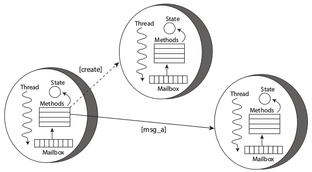

# Architektura systemu informatycznego

Złożoność systemów informatycznych stale rośnie. Wraz ze złożonością zwiększa się ich zapotrzebowanie na moc obliczeniową. Biorąc pod uwagę spowalniające prawo Moore'a, zaspokojenie potrzeby zwiększenia mocy jest znacznie utrudnione. Rozwiązaniem tego problemu jest stosowanie architektur równoległych, procesorów wielordzeniowych i układów wieloprocesorowych. Wzrost zainteresowania komputerami wielordzeniowymi niesie ze sobą narzut na programistów, zmuszając ich do tworzenia oprogramowania współbieżnego \autocite{stutter2005software}. Dominującym modelem programowania współbieżnego jest wykorzystanie pamięci współdzielonej pomiędzy wiele, działających paralelnie wątków. Jednakże, takie podejście jest nienaturalne dla deweloperów, bardzo łatwo popełnić błąd. Prowadzi to do powstawania oprogramowania nieodpornego na błędy, które trudno skalować \autocite{lee2006problem}.

TODO: 

Typowe wzorce architektoniczne dla poszczególnych technologii.

## Java

Architektura silnie związana ze standardami JavaEE.

### Architektura wielowarstwowa

Standardowy wzorzec dla aplikacji JEE. Opis podziału na część webową, logikę biznesową i bazę danych. 

## JavaScript

Brak standardowych rozwiązań. Przedstawienie popularnych podejść z wielu, wynikających z szerokiej społeczności.

### Asynchroniczność

libuv jako podstawa działania Node.js. Wady i zalety asynchroniczności dla modelu przyjętego w Node.js

## Elixir

Dziedzictwo 30 lat Erlanga i wypracowanych wzorców. Standardy i wzorce OTP.

### Model aktorowy

- potrzeba współbieżności 
- czym są aktorzy 
- podstawowe założenia
- rozwiązywane problemy

Aktorzy są modelem programowania współbieżnego. Są to obiekty o współbieżnym przetwarzaniu porozumiewające się wyłącznie asynchronicznymi wiadomościami. Każdy z aktorów przechowuje otrzymane wiadomości w skrzynce odbiorczej i przetwarza je sekwencyjnie, po jednej w danym czasie. Po przeprocesowaniu wiadomości aktor może zmienić swój stan, wysłać wiadomość lub stworzyć kolejnego aktora.  

Taki model przetwarzania pozwala uniknąć zablokowania przez czekającą wiadomość, co pozwala na łatwiejsze unikanie zakleszczeń w systemie.
Obsługa każdej z wiadomości jest operacją atomową.  
Aktorzy są od siebie odizolowani, nie dzielą między sobą zasobów i stanu. Takie podejście zmniejsza ryzyko wystąpienia zjawiska wyścigu. Połączenie asynchronicznego wykonywania i izolacji pozwala w pełni wykorzystać moc wielordzeniowych procesorów. Z tego względu model aktorowy jest atrakcyjny przy zastosowaniu ze współczesnymi architekturami.  
Inną cechą aktorów jest przezroczystość położenia. Poszczególne jednostki rozpoznają się używając unikalnych adresów. Bez konieczności znajomości lokalizacji odbiorcy aktorzy mogą być rozdystrybuowani w system rozproszony. W związku z tym systemy oparte o model aktorowy skalują się na wiele różnych maszyn.

